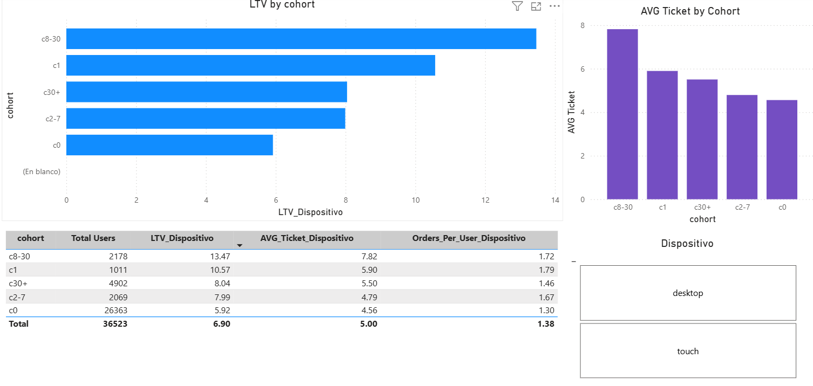

# Data-Driven Growth Analytics: Optimizing User Cohorts and Marketing ROI
**Growth Analytics · Multichannel ROI · Cohort Analysis · Python · Power BI**

[← Back to Projects](/projects/)

---

## Business Context

An entertainment ticketing platform required a comprehensive diagnostic of its user behavior and marketing spend efficiency. The operation needed to understand purchase velocity, identify high-value customer segments, and evaluate the true return on its advertising investments across multiple acquisition channels.

---

## Objectives

- Profile platform engagement (DAU, WAU, MAU) and diagnose retention barriers.
- Segment buyers into conversion cohorts to measure purchase velocity, Customer Lifetime Value (LTV), and average ticket.
- Quantify Customer Acquisition Cost (CAC) and Return on Marketing Investment (ROMI) across 7 channels to reallocate budget efficiently.

---

## Methodology

**1. Data Pipeline & Feature Engineering**
- Standardized cross-dataset headers to `lower_snake_case` and cast timestamps to `datetime64[ns]`.
- Engineered explicit session durations and built purchase-velocity cohorts using first-visit and first-purchase timestamps.
- Applied **volume‑weighted aggregation** to correct for dataset skewness during exploratory analysis.

**2. Product Dynamics & Seasonality**
- Established traffic baselines: **DAU (908 unique users)** and **WAU (5,716 unique users)**.
- Detected strong late‑Q4 cyclical peaks (November) and a retention bottleneck: only **19.7%** of users return on distinct days.
- Identified **intensive single‑day users** (multiple sessions on the same day) with a purchase rate of **40.60%** vs. **10.47%** for single‑session users (Z‑test, p=0).

**3. Cohort & Marketing Performance Optimization**
- Segmented buyers into conversion‑velocity windows (C0, C1, C2‑7, C8‑30, C30+).
- Used **first‑touch attribution** to correctly assign revenue to the original acquisition channel, preventing the revenue inflation that occurs when aggregating multiple sessions.
- Mapped transactional revenue against daily ad spend to calculate unit CAC and channel‑specific ROMI.

---

## Key Results

### User Cohort Architecture

| Cohort Window | % Share | Avg. Ticket | User LTV | Key Takeaway |
| :--- | :---: | :---: | :---: | :--- |
| **C0 (Immediate / Day 0)** | 72.2% | $4.56 | $5.92 | Core volume driver but lowest individual LTV. |
| **C1 (1 Day)** | 2.8% | $5.90 | $10.57 | Small but high‑ticket segment. |
| **C2‑7 (2 to 7 Days)** | 5.7% | $4.79 | $7.99 | Moderate value, short research phase. |
| **C8‑30 (8 to 30 Days)** | 6.0% | $7.82 | $13.47 | **Highest value**; intensive research phase. |
| **C30+ (Over 30 Days)** | 13.4% | $5.50 | $8.04 | Late buyers with intermediate LTV. |

**Insight:** C8‑30 users represent only 6% of buyers but generate the highest LTV ($13.47), making them the prime target for retargeting and nurturing campaigns.

### Multichannel Acquisition Efficiency (Corrected)

| Source ID | Total Spend | Unit CAC | ROMI (%) | Operational Diagnosis |
| :---: | :---: | :---: | :---: | :--- |
| **1** | $20,833 | $2.20 | **49%** | Highly Profitable (Scale) |
| **2** | $42,806 | $2.43 | **9.6%** | Moderately Profitable (Maintain) |
| **3** | $141,322 | $2.14 | **-61%** | Highly Inefficient (Reduce) |
| **4** | $61,074 | $0.84 | **-7%** | Marginal (Optimize) |
| **5** | $51,757 | $1.05 | **1.6%** | Break-even (Investigate) |
| **9** | $5,517 | $0.86 | **4.4%** | Positive Niche (Monitor) |
| **10** | $5,822 | $0.84 | **-23%** | Loss-making (Eliminate) |

* **Structural Inefficiency:** Source 3 consumes the highest budget ($141K) while destroying value (-61% ROMI) due to high volume of low-quality traffic (84% non-buyers, low retention).

### Quality of Traffic (Integrated View)

| Source | % No Buyers | % C8-30 (High Value) | Avg. Days Active | Avg. Session Duration |
| :---: | :---: | :---: | :---: | :---: |
| 1 | **69%** (Best) | 2% | 2.08 | 12.18 min |
| 3 | 84% | 1% | 1.41 | 8.89 min |
| 9 | 83% | **6%** (Late Buyers) | 1.82 | 8.74 min |

**Key Takeaways:**
- **Source 1** wins on quality: highest retention and lowest non-buyer rate.
- **Source 3** is a volume trap: high users, terrible quality.
- **Source 9** is a hidden opportunity: it attracts the highest proportion of late-stage buyers (C30+).

---

## Conclusions

To optimize commercial growth, capital must be **immediately reallocated**:
1. **Eliminate Source 10** and drastically **reduce Source 3** by 80%, redirecting funds to Source 1 and 2.
2. **Optimize Source 4**: Improve the landing page to increase immediate conversion from 10% to 12% to turn it profitable.
3. **Nurture the Funnel**: Deploy retargeting campaigns for the high‑value C8‑30 segment and integrate upselling in the immediate C0 funnel.

---

## Interactive Dashboard

A Power BI dashboard was built to allow stakeholders to explore these insights interactively. It includes three pages:
1. **Executive Summary** – Global KPIs, LTV by cohort, and ROMI by channel.
2. **Marketing Efficiency** – CAC/ROMI comparison per channel with detailed traffic quality metrics.
3. **Cohort Analysis** – LTV, average ticket, and orders per user, with an interactive filter by device (`desktop` / `touch`).

### Dashboard Preview

📊 [Download the .pbix file](https://github.com/Esparza-Data-An/Data-Driven-Growth-Analytics--Optimizing-User-Cohorts-and-Marketing-ROI-for-Entertainment-Ticketing/blob/main/growth_analytics_dashboard.pbix) *(requires Power BI Desktop)*

---

## Resources

- 📓 [View Notebook on GitHub](https://github.com/Esparza-Data-An/Data-Driven-Growth-Analytics--Optimizing-User-Cohorts-and-Marketing-ROI-for-Entertainment-Ticketing)

[← Back to Projects](/projects/)
