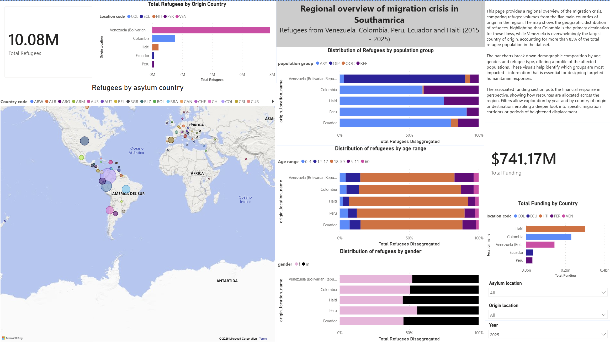
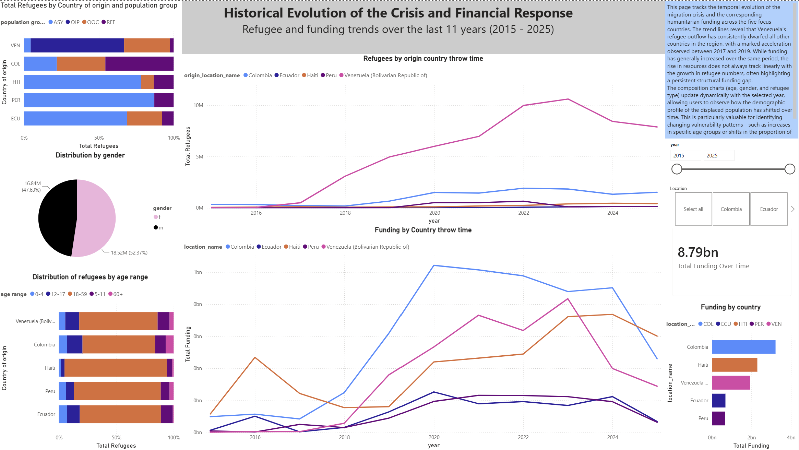
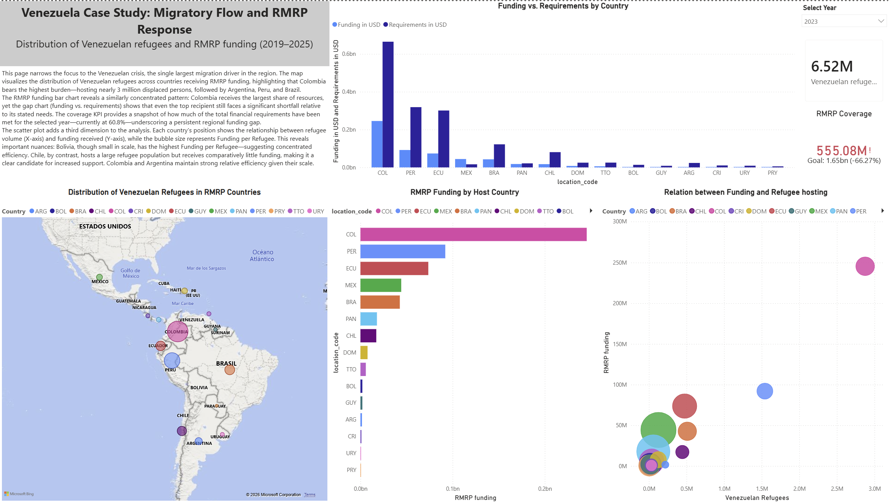

# Refugee Migration & Humanitarian Funding Dashboard
**Migration Analytics · Humanitarian Data · Power BI · ETL**

[← Back to Projects](/projects/)

---

## Business Context

The Latin American migration crisis has generated significant refugee flows, with Venezuela as the primary country of origin. The region has responded with humanitarian funding through various mechanisms, including the Regional Refugee and Migrant Response Plan (RMRP). However, the distribution of these resources is not always proportional to each country's migratory burden.

This dashboard was built to enable stakeholders to explore the data interactively—identifying patterns, anomalies, and potential gaps in funding distribution.

---

## Dashboard Objectives

- Provide a **comprehensive view** of refugee flows from five origin countries (Venezuela, Colombia, Peru, Ecuador, Haiti) and their distribution across host countries.
- Enable **temporal exploration** of refugee volumes and humanitarian funding from 2015 to 2025.
- Allow users to **evaluate funding efficiency** (Funding per Refugee) and demographic burden (Refugees per 1000 inhabitants) interactively.
- Facilitate the **identification of funding gaps** in the RMRP and other mechanisms through visual exploration.

---

## Dashboard Features

**1. Data Pipeline & ETL**
- Connected Power BI directly to HDX HAPI (humanitarian data) and World Bank API (population data) via Power Query.
- Cleaned and transformed data—handled duplicates, nulls, and created a star schema with `dim_country` and `dim_year` as dimension tables.
- Engineered key DAX measures: `Total Refugees`, `Total Funding`, `Funding per Refugee`, `Refugees per 1000`, among others.

**2. Dashboard Structure**
- **Page 1: Regional Overview** – Refugee distribution maps, origin breakdown, demographic composition (age, gender, refugee type), and key KPIs (total refugees and funding).
- **Page 2: Historical Evolution** – Trends in refugee volumes and total humanitarian funding (2015–2025), with interactive filters by year and country of origin.
- **Page 3: Venezuela Case Study** – RMRP funding distribution by host country, gap analysis (Funding vs. Requirements), and a scatter plot (Refugees vs. RMRP Funding) with bubble size = Funding per Refugee.

---

## Key Capabilities

| Capability | Purpose |
| :--- | :--- |
| **Map & Origin Charts** | Visualize where refugees are located and where they come from. |
| **Demographic Composition** | Explore age, gender, and refugee type distribution. |
| **Temporal Trends** | Track changes in refugee volumes and funding over 11 years. |
| **Efficiency Metrics** | Evaluate `Funding per Refugee` and `Refugees per 1000` interactively. |
| **RMRP Gap Analysis** | Compare funding received vs. requirements to identify gaps. |
| **Scatter Plot (Refugees vs. Funding)** | Explore relationships between refugee burden and funding allocation. |

---

## Technical Implementation

| Component | Description |
| :--- | :--- |
| **Data Sources** | HDX HAPI (refugee and funding data), World Bank API (population data) |
| **ETL Tool** | Power Query (direct API connection, cleaning, transformation) |
| **Data Model** | Star schema with `dim_country` and `dim_year` as dimension tables |
| **Measures** | Custom DAX measures for total refugees, funding, efficiency, and per capita metrics |
| **Visualization** | 3-page interactive dashboard with filters and tooltips |

---

## Interactive Dashboard

A Power BI dashboard was built to allow stakeholders to explore these insights interactively. It includes three pages:

1. **Regional Overview** – Refugee distribution maps, origin breakdown, demographic composition, and key KPIs.
2. **Historical Evolution** – Trends in refugee volumes and total humanitarian funding (2015–2025).
3. **Venezuela Case Study** – RMRP funding distribution, gap analysis, and scatter plot.

### Dashboard Preview

📊 [Download the .pbix file](https://github.com/Esparza-Data-An/HAPI-Refugees-in-South-America/blob/main/refugee_dashboard.pbix) *(requires Power BI Desktop)*

---

## Resources

- 📓 [View Repository on GitHub](https://github.com/Esparza-Data-An/HAPI-Refugees-in-South-America)

[← Back to Projects](/projects/)